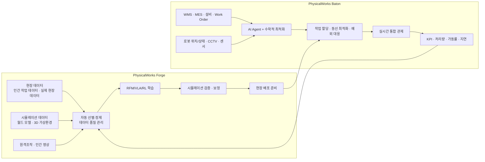

# LG CNS PhysicalWorks 심층 조사 보고서

## Executive summary

LG CNS가 2026년 5월 공개한 **피지컬웍스(PhysicalWorks)**는 로봇의 **데이터 수집·학습·검증·현장 적용·운영·관제**를 하나의 브랜드 아래 묶은 RX(Robot Transformation) 플랫폼이다. 공식 자료상 핵심 제품은 **피지컬웍스 포지(PhysicalWorks Forge)**와 **피지컬웍스 바통(PhysicalWorks Baton)**이며, 질문에 포함된 **“Physical Pose”라는 명칭은 확인되지 않았고** 이는 포지(Forge)를 잘못 들었을 가능성이 높다. Forge는 **RFM 학습용 데이터 파이프라인과 시뮬레이션·검증 루프**를, Baton은 **이기종 로봇과 설비를 하나의 워크플로우로 묶는 운영·관제 계층**을 담당한다. 다만 **API, 데이터 포맷, 센서 BOM, 추적 알고리즘, 수치형 latency, 정확도, 가격** 같은 저수준 사양은 공개 자료에서 대부분 확인되지 않았다. 현재 공개된 정량 수치는 주로 회사 추정치로, **로봇 현장 투입 기간을 수개월에서 1~2개월로 단축**, **100대 규모 운영 시 생산성 15% 이상 향상·운영비 최대 18% 절감**이 대표적이며, 실제 검증은 **20곳 이상 PoC, 부산 스마트시티, 컬리 물류센터 실증**을 통해 진행 중이다. citeturn4view0turn45view0turn46view0turn20view0turn17view0

## 명칭 정정과 솔루션 개요

LG CNS 공식 보도자료와 RX 페이지를 기준으로 보면, 브랜드의 정확한 표기는 **PhysicalWorks**이며 하위 플랫폼은 **PhysicalWorks Forge**와 **PhysicalWorks Baton**이다. LG CNS는 이를 “국내 기업 최초”의 로봇 학습·운영 엔드투엔드 플랫폼이라고 설명한다. 또한 RX를 단순한 장비 도입이 아니라 **로봇을 하나의 ‘Workforce’로 학습·배치·운영하는 체계**로 정의하고 있다. citeturn4view0turn45view0

| 사용자 표현 | 공식 확인 결과 | 비고 |
|---|---|---|
| 피지컬포지 / Physical Pose? | **피지컬웍스 포지(PhysicalWorks Forge)**가 공식 명칭이다. “Physical Pose”는 공식 자료에서 확인되지 않았다. | LG CNS는 Forge를 “단련하다”는 의미에서 명명했다고 설명했다. citeturn4view0 |
| 피지컬바통 / Physical Baton? | **피지컬웍스 바통(PhysicalWorks Baton)**이 공식 명칭이다. | 바통은 “지휘봉”의 의미로, 이기종 로봇 통합 운영을 강조한다. citeturn4view0 |
| 피지컬웍스 | 로봇 **학습부터 운영까지 전 주기**를 통합한 RX 플랫폼 브랜드 | 공식 마이크로사이트/소개 페이지도 존재한다. citeturn4view0turn23search8 |

현시점 공개 정보만 놓고 보면, PhysicalWorks의 차별점은 **“학습 플랫폼(Forge) + 운영 플랫폼(Baton) + 현장 데이터 피드백 루프”**를 하나의 상용 스토리로 제시한다는 데 있다. 해외 유사 솔루션 다수는 시뮬레이션·학습 또는 관제·오케스트레이션 한쪽에 강점이 있으나, LG CNS는 이를 산업 SI와 결합해 **물류·제조·시티·보안**으로 확장하려는 전략을 공개적으로 밝히고 있다. citeturn45view0turn46view0turn17view0turn18view0turn19search0

## 구성요소와 시스템 아키텍처

LG CNS가 공개한 구조는 비교적 명확하다. **Forge는 데이터 수집·큐레이션·모델 학습·시뮬레이션 검증·배포 준비**를 담당하고, **Baton은 Work Order, 로봇 상태, 설비 상태, CCTV/센서 데이터를 묶어 실시간 운영과 예외 대응**을 수행한다. 운영 중 생기는 예외 데이터와 현장 데이터는 다시 Forge로 환류돼 재학습과 최적화에 쓰인다. 이는 LG CNS가 공식적으로 설명한 **학습–운영 선순환 구조**다. citeturn4view0turn45view0turn46view0

| 구성요소 | 공식 역할 | 공개된 핵심 기능 |
|---|---|---|
| **Forge** | 피지컬 AI 로봇의 데이터 관리 및 RFM 학습용 올인원 플랫폼 | 고속 학습 데이터 수집, 자동 데이터 품질 관리, 원클릭 자동학습, 고품질 시뮬레이션, 학습 인프라 효율화 citeturn45view0 |
| **Baton** | 이기종 로봇을 하나의 Workforce로 운영하는 통합 오케스트레이션 플랫폼 | 통합 워크플로우, 신규 로봇 신속 투입, 실시간 통합 관제, 유연한 모듈형 구조, 상황인지 기반 실시간 최적화, 맞춤형 대시보드, Agentic AI 기반 실행 citeturn46view0 |
| **Vertical Solutions** | 산업별 현장 적용 패키지 | 보안, 물류, 제조, 데이터센터용 로봇 솔루션을 공개적으로 제시 citeturn46view0 |

## 피지컬웍스 포지

Forge는 공개 자료상 **“로봇 두뇌(RFM) 학습”**에 초점이 있다. LG CNS는 인간 작업 데이터, 시뮬레이션 데이터, 실제 현장 데이터를 결합해 고품질 학습 데이터를 빠르게 확보하고, 자동 큐레이션으로 유효한 데이터만 선별·가공해 학습 효율을 높인다고 설명한다. 또 모델이나 학습 방법을 특정 방식으로 강제하기보다, 데이터 관리·검증·sim-to-real 반복 같은 **운영상 반복 문제를 줄이는 플랫폼**으로 포지셔닝하고 있다. citeturn45view0

LG CNS가 추가로 공개한 주변 자료를 합치면, Forge는 **teleoperation, 인간 영상, world models, simulation**을 데이터 원천으로 사용하며, 향후 **사람의 작업 영상을 학습 데이터로 전환하는 방식과 모션캡처 활용**도 추가할 계획이다. 2025년 AX Fair 자료에서는 LG CNS가 **VLA(Vision-Language-Action) 학습, 시뮬레이션 기반 강화학습, 오픈소스 RFM 파인튜닝** 연구를 진행한다고 밝혔다. 다만 이것이 Forge 내부에 제품화된 기능인지, 혹은 LG CNS 로보틱스 연구개발의 범주인지는 공개문서만으로 완전히 분리되지는 않는다. citeturn4view0turn22view0turn18view0

| 항목 | 공개 확인 내용 | 공개 근거 |
|---|---|---|
| 정의 | 로봇 학습 데이터 수집부터 학습·검증·현장 적용 준비까지 잇는 플랫폼 | LG CNS 보도자료, RX 페이지 citeturn4view0turn45view0 |
| 기술 원리 | 실제 현장 데이터 + 인간 작업 데이터 + 시뮬레이션 데이터를 결합하고, 자동 데이터 큐레이션으로 품질 관리 | RX 페이지 citeturn45view0 |
| 학습 데이터 | teleoperation, human video, world models, simulation, actual field data; 향후 motion capture 추가 계획 | RX 페이지, 보도자료 citeturn45view0turn4view0 |
| 모델/ML·DL | RFM 중심. LG CNS는 VLA, 강화학습, 오픈소스 RFM 파인튜닝 연구를 공개했으며, Skild AI와 산업 특화 RFM 협력도 진행 중 | AX Fair 2025, Skild AI 협력 보도자료 citeturn22view0turn18view0 |
| 검증 방식 | 3D 가상환경 시뮬레이션, 검증·보정·재학습 자동 반복 | 보도자료, RX 페이지 citeturn4view0turn45view0 |
| 하드웨어 | GPU 및 학습 자원 효율화를 언급하지만 구체 GPU 모델, 서버 사양, 엣지 디바이스 사양은 **확인 불가** | RX 페이지는 “GPU와 학습 자원 효율화”만 언급 citeturn45view0 |
| 센서 종류 | 언어·이미지·영상 데이터와 로봇 센서기반 RFM을 언급하지만, RGB/RGB-D/LiDAR/IMU/Force-Torque 등 구체 센서 BOM은 **확인 불가** | RFM 정의·학습 데이터 설명 공개, 상세 BOM 미공개 citeturn18view0turn22view0turn45view0 |
| 추적 알고리즘 | 객체 추적·포즈 추정·SLAM·trajectory tracking 알고리즘 명칭은 **확인 불가** | 공개 자료 미기재 |
| 인터페이스/API | “표준화된 인터페이스”는 언급되지만, SDK/REST/gRPC/ROS2/VDA5050 수준의 명세는 **확인 불가** | RX 페이지 citeturn45view0 |
| 데이터 포맷 | 멀티모달 데이터 활용은 확인되나 JSON/Parquet/ROS bag/OpenUSD 등 포맷은 **확인 불가** | 공개 자료 미기재 |
| 실시간성/지연 | 배포 후 학습 루프의 지속성은 강조되지만, ms 단위 latency/SLA는 **확인 불가** | 공개 자료 미기재 |
| 정확도 | 작업 정확도 수치나 benchmark score는 **확인 불가** | 컬리 PoC에서 향후 측정 예정임만 공개 citeturn20view0 |
| 확장성 | 대규모 학습에서 GPU 자원 효율화와 반복 재학습 지원 | RX 페이지 citeturn45view0 |
| 호환성 | 특정 모델·학습법을 강제하지 않는다고 설명하지만, 지원 OS/클라우드/온프레미스 매트릭스는 **확인 불가** | RX FAQ citeturn45view0 |
| 보안·프라이버시 | 인간 영상·현장 영상 데이터를 다루므로 데이터 거버넌스가 중요하나, Forge 전용 암호화/권한/마스킹 설계는 **확인 불가** | 공개 자료 미기재; 법적 요구는 후술 |
| 비용 | 공개 가격·라이선스 체계 **확인 불가** | 공개 자료 미기재 |

요약하면, Forge의 공개 경쟁력은 **데이터 파이프라인 자동화와 sim-to-real 운영 효율화**에 있다. 반면 사용자가 요구한 수준의 저수준 기술 명세는 공개되어 있지 않으므로, 실제 도입 검토 단계에서는 **데이터 소유권, 영상 비식별화, 학습 인프라 배치 방식, MLOps 경계**를 반드시 별도 질의해야 한다. citeturn45view0turn20view0

## 피지컬웍스 바통

Baton은 로봇을 장비가 아니라 **“실행 계층의 Workforce”**로 다루는 운영 플랫폼으로 소개된다. 핵심 원리는 공개 자료상 세 가지다. 첫째, **이기종 로봇과 설비를 하나의 workflow로 연결**한다. 둘째, **수학적 최적화**로 작업 할당과 동선을 조정한다. 셋째, **에이전틱 AI**가 Work Order와 우선순위, 현장 조건을 반영해 실행 계획을 동적으로 바꾼다. citeturn4view0turn46view0

Baton은 특히 **WMS, MES, 설비 시스템과의 연계**를 전제로 설계된 점이 중요하다. LG CNS는 단순한 로봇 위치 모니터링이 아니라, 로봇 위치·상태를 작업 우선순위, 설비 상태, 재고/출하 흐름과 연결해야 “실제 생산성 향상”이 가능하다고 명시한다. 또한 **CCTV, 센서, 설비 데이터와 로봇 위치/상태 정보를 하나의 화면에서 함께 본다**고 밝히고 있어, 현장 관제와 OT/보안 데이터 융합 성격도 분명하다. citeturn46view0

| 항목 | 공개 확인 내용 | 공개 근거 |
|---|---|---|
| 정의 | 제조사·형태가 다른 로봇을 하나의 체계로 운영하는 통합 관제/오케스트레이션 플랫폼 | 보도자료, RX 페이지 citeturn4view0turn46view0 |
| 기술 원리 | 로봇 상태/제어 정보 표준화, 수학적 최적화 기반 작업 자동 배분·동선 최적화, Agentic AI 기반 실행 계획 생성 | 보도자료, RX 페이지 citeturn4view0turn46view0 |
| 소프트웨어 구성 | 통합 workflow 엔진, KPI 대시보드, 실시간 관제, 예외 대응, 모듈형 기능 확장 | RX 페이지 citeturn46view0 |
| 하드웨어 구성 | 특정 하드웨어에 종속되지 않는 플랫폼으로 보이며, biped/quadruped/wheel/AMR 등 이기종 로봇과 연동; 자체 하드웨어 사양은 **확인 불가** | 보도자료, 시연 설명 citeturn4view0 |
| 입력 데이터 | 로봇 위치·상태, CCTV, 센서, 설비 데이터, Work Order, 재고 흐름, 출하 스케줄 | RX 페이지 citeturn46view0 |
| 인터페이스/API | 기존 WMS·MES·설비 시스템 연계를 고려한 설계. 구체 API/프로토콜 명세는 **확인 불가** | RX FAQ citeturn46view0 |
| 데이터 포맷 | 운영 상태·성과·센서·CCTV 데이터를 다루지만 메시지/스키마 포맷은 **확인 불가** | 공개 자료 미기재 |
| 실시간성 | 실시간 통합 제어, 실시간 상황인지 최적화, 즉각적 예외 대응을 공식적으로 강조 | RX 페이지, 보도자료 citeturn46view0turn4view0 |
| 지연(latency) | ms 단위 latency, 제어 주기, SLA는 **확인 불가** | 공개 자료 미기재 |
| 정확도·KPI | 생산성, 처리량, 가동률, 작업 지연 등을 대시보드로 본다고만 공개. 정량 정확도는 **확인 불가** | RX 페이지 citeturn46view0 |
| 성능 수치 | 100대 규모 AMR·AGV 등 운영 환경에서 생산성 15% 이상 향상, 운영비 최대 18% 절감은 회사 추정치 | 보도자료 citeturn4view0 |
| 센서 종류 | CCTV, 센서, 설비 데이터를 함께 본다고 공개. 그러나 LiDAR/vision/IMU/uWB 등 로봇별 센서 세부는 **확인 불가** | RX 페이지 citeturn46view0 |
| 추적 알고리즘 | 동선 최적화와 충돌 방지는 언급되나, traffic control/SLAM/fleet scheduler 알고리즘 이름은 **확인 불가** | 보도자료 미기재 |
| 확장성 | 모듈형 구조, 단계적 도입, 신규 로봇 신속 연결·검증·배포 | RX 페이지 citeturn46view0 |
| 호환성 | 다수 제조사·다양한 타입의 로봇, 기존 WMS/MES/설비와 연계 가능성 공개; 지원 OS/브라우저/모바일 앱 정보는 **확인 불가** | RX FAQ citeturn46view0 |
| 보안·프라이버시 | 로봇 데이터와 CCTV/센서/설비 데이터를 함께 다루므로 개인정보·OT 보안 통제가 핵심. 제품 전용 보안 아키텍처는 **확인 불가** | 공개 자료 미기재; LG CNS 보안 역량은 후술 citeturn31view0 |
| 비용 | 공개 가격·구독·프로젝트 단가 **확인 불가** | 공개 자료 미기재 |

결론적으로 Baton은 **다중 로봇 오케스트레이션 + 현장 SI 연결 + KPI 기반 운영 최적화** 성격이 강하다. 단, 사용자가 직접 요구한 **API 수준 명세, plugin 모델, edge/cloud 분산 구조, deterministic control latency**는 공개되지 않았으므로, 대규모 도입 시에는 PoC RFP 단계에서 반드시 별도 검증해야 한다. citeturn46view0turn4view0

## 도입 사례와 운영·경제성

현재까지 공식적으로 확인되는 대표 사례는 세 가지다. 첫째, LG CNS는 RX 미디어데이에서 **이족보행·사족보행·휠 타입·AMR 4종 로봇이 사람의 원격조종 없이 자율 협업**하는 장면을 시연했다. 둘째, **Forge는 20곳 이상의 고객사와 PoC**를 진행 중이라고 밝혔다. 셋째, **Baton은 부산 스마트시티 국가시범도시**에서 순찰·바리스타·짐캐리·청소 로봇 4종의 통합 관제에 활용 중이라고 했다. citeturn4view0

추가로 LG CNS와 컬리는 2026년 5월 **물류센터 휴머노이드 PoC 협약**을 맺고, PhysicalWorks의 **현장 적합성, 작업 정확도, 수행 속도, 기존 방식 대비 효율 개선**을 측정·분석하겠다고 발표했다. 이 실증은 아직 결과 수치가 공개되지 않았지만, 사용자가 요구한 정확도·속도 benchmark가 향후 가장 먼저 나올 가능성이 높은 레퍼런스다. citeturn20view0

운영 체계 측면에서 보면, LG CNS는 **RX 이노베이션 랩**을 통해 **Insight–Design–Proof**의 3단계 도입 프로그램을 제공하고, 워크플로우 재설계와 PoC까지 지원한다. 또한 **RFM–플랫폼–하드웨어**를 결합한 **풀스택 RX 서비스**를 제공할 계획이라고 밝혔다. 여기서 하드웨어 측면은 Skild AI, Config, Dexmate 같은 파트너십과 투자로 보강되고 있다. Dexmate 투자 보도자료에 따르면 LG CNS가 겨냥하는 휴머노이드 하드웨어 예시로는 **휠 기반 하체, 양팔, 비전 센서 헤드, 36개 이상 자유도, 양팔 기준 약 15kg 적재, 20시간 이상 배터리** 같은 산업형 스펙이 제시됐다. 다만 이는 **PhysicalWorks 본체의 사양이 아니라 연계 하드웨어 전략**으로 보는 것이 정확하다. citeturn17view0turn19search0turn18view0

경제성 측면의 공개 수치는 제한적이다. 공식적으로 제시된 것은 **Forge 도입 시 로봇 현장 투입 기간 수개월 → 1~2개월**, **Baton 적용 시 100대 규모 환경에서 생산성 15% 이상 향상·운영비 최대 18% 절감**뿐이다. 이 수치는 외부 독립 벤치마크가 아니라 **LG CNS의 기대/추정치**로 읽는 것이 엄밀하다. 또한 라이선스 비용, 구축비, 유지보수료, GPU 비용, 로봇당 월 비용 같은 가격 정보는 공개 자료에서 찾지 못했다. citeturn4view0turn46view0

## 리스크·법률·표준·IP·로드맵

PhysicalWorks의 가장 큰 기술적 리스크는 **sim-to-real 격차**, **이기종 로봇 인터페이스 표준화 난이도**, **레거시 WMS/MES/설비와의 통합 복잡성**, **현장 데이터 거버넌스**, 그리고 **OT/IoT 사이버보안**이다. 공개 자료만 보면 LG CNS는 이 문제를 인식하고 자동 큐레이션, 표준화된 연결, 모듈형 구조, 실시간 예외 대응을 강조하지만, 그 구현 세부는 아직 비공개다. 따라서 도입 검증 포인트는 “기능 존재 여부”보다 **고객 환경에서의 성능 재현성**이 되어야 한다. citeturn45view0turn46view0turn31view0

법률·표준 측면에서는 다음 축이 중요하다. 한국 개인정보보호위원회는 **고정형 영상정보처리기기(CCTV)**와 **이동형 영상정보처리기기(드론·로봇 등)**에 대한 별도 안내서를 운영하고 있어, Baton이 CCTV·센서와 결합되고 보안/순찰 vertical에서 영상·열화상·음향 이상징후를 다루는 경우 **PIPA 준수와 촬영 목적·범위·보관·열람 통제**가 핵심 이슈가 된다. 산업 안전 측면에서는 **ISO 10218-1/2**와 **ISO/TS 15066**이 산업용·협동로봇 안전의 기본 축이고, 국내에서는 **산업안전보건법상 안전검사**와 한국 표준 적합성이 중요하다. OT/IoT 사이버보안은 **ISA/IEC 62443** 계열이 대표적 기준이다. 또한 2026년 1월 22일 시행된 한국 **AI 기본법**은 AI 신뢰 기반과 안전 요구를 제도화했으므로, PhysicalWorks가 안전·운영 의사결정에 영향을 미치는 방식으로 확대될수록 투명성·안전성 검토의 중요성이 커질 수 있다. citeturn32search0turn32search4turn32search1turn32search8turn33search0turn35search0turn35search1turn32search6turn34search9turn34search4

| 영역 | 관련 법·표준 | PhysicalWorks 관점의 의미 |
|---|---|---|
| 개인정보·영상 | PIPA, 고정형/이동형 영상정보처리기기 안내서 | CCTV·로봇 카메라·인간 작업 영상 학습 시 촬영 목적, 최소수집, 보관·열람 통제가 중요 citeturn32search0turn32search4 |
| 산업용 로봇 안전 | ISO 10218-1/2, 국내 안전검사 기준 | 제조·물류 셀 통합과 협동 운전 시 안전 설계·통합·검사 필요 citeturn32search1turn32search8turn35search0 |
| 협동작업 | ISO/TS 15066 | 사람과 로봇이 공간을 공유할 경우 위험성평가와 협동 모드 검증 필요 citeturn33search0turn33search3 |
| OT·산업 보안 | ISA/IEC 62443 | 설비·센서·로봇·클라우드 연계 시 IACS 보안 프레임워크 중요 citeturn32search6 |
| AI 거버넌스 | AI 기본법 | 안전·신뢰 기반 조성과 AI 사업자 책임 검토 필요 citeturn34search9turn34search4 |

IP와 로드맵도 공개 정보는 제한적이다. 공개 보도에 따르면 LG CNS는 2026년 3월 **‘피지컬웍스(PhysicalWorks)’ 상표를 출원**했으며, 지정상품에는 자동화 소프트웨어, 휴머노이드 로봇, 로봇 관리 SW, 원격제어장치, 데이터 가공·통계 분석, 설치·유지관리 등이 포함된 것으로 보도됐다. 반면 **Forge/Baton에 직접 연결되는 특허번호나 명세서 수준의 공개 특허는 본 조사 범위에서 확인되지 않았다.** 공식 로드맵으로는 **사람 작업 영상의 학습데이터 전환**, **모션캡처 추가**, **보안·물류·제조·데이터센터 vertical 확장**, **RFM·플랫폼·하드웨어를 결합한 풀스택 RX 서비스**, 그리고 **인간 개입을 최소화하는 자율 운영 플랫폼**이 확인된다. citeturn30search2turn4view0turn45view0turn46view0turn17view0turn18view0turn19search0

## 경쟁 비교와 참고 자료

아래 비교는 **공개 제품 자료 기준의 기능 비교**다. 즉, LG CNS PhysicalWorks와 모든 면에서 완전히 동형인 제품을 찾기보다는, **Forge에 가까운 학습·시뮬레이션 계열**과 **Baton에 가까운 오케스트레이션·관제 계열**을 함께 놓고 본 것이다. 가격은 공개되지 않은 경우 **“확인 불가”**로 표기했다. citeturn42search0turn40search1turn38search1turn43search0turn37search1

| 솔루션 | 공개 범위 | 공개 가격 | 강점 | 약점 | 비교 판단 |
|---|---|---|---|---|---|
| **NVIDIA Isaac GR00T + Isaac Sim + Mission Dispatch** citeturn42search0turn42search2turn42search1 | RFM 개발, 시뮬레이션, synthetic data, fleet communication | 정가 **확인 불가** | 시뮬레이션·합성데이터·기초 모델 생태계가 매우 강함 | 고객 현장 운영체계·SI는 별도 통합이 필요 | **Forge 영역의 가장 강한 글로벌 비교군** |
| **InOrbit Space Intelligence** citeturn40search1turn40search2 | AI 기반 로봇 오케스트레이션·운영 | **확인 불가** | secure/scalable cloud, unified command, orchestration에 특화 | 학습·시뮬레이션 풀루프 공개 범위는 상대적으로 약함 | **Baton과 가장 직접적으로 경쟁** |
| **Formant** citeturn38search1turn38search0turn39search2 | fleet monitoring, workflows, data/ops platform | **성과기반(pricing for results)**, 숫자형 정가 확인 불가 | 관측성·운영성·화이트라벨 UI·데이터 플랫폼 강점 | 로봇 학습 플랫폼보다는 운영/관측 쪽에 무게 | **Baton 유사, Forge 대체는 어려움** |
| **SVT Robotics SOFTBOT Platform** citeturn43search0turn43search2turn43search8 | 산업 SW–로봇–자동화 연결 및 orchestration | **확인 불가** | 공급망 시스템 연계, prebuilt connector, 빠른 배포 | RFM 학습/시뮬레이션은 핵심 범위가 아님 | **레거시 WMS/WCS 통합 관점에서 강한 대안** |
| **클로봇 CROMS** citeturn37search1turn37search9 | 국내 이기종 로봇 통합 관제 | **확인 불가** | 국내 레퍼런스, 클라우드 기반, 브랜드·OS 무관 통합관제, 충돌 방지·스케줄 최적화 | 공개 자료상 RFM 학습/시뮬레이션 계층은 약함 | **국내 Baton 유사 경쟁군** |

해석을 덧붙이면, **PhysicalWorks의 상대적 장점은 “학습(Forge)과 운영(Baton)을 같은 브랜드와 SI 역량 아래 묶어 낸 점”**이다. 반대로 **약점은 제품 세부 스펙 비공개가 많아 구매자 입장에서 기술 실사 난도가 높다**는 점이다. 경쟁사 다수도 가격을 숨기지만, LG CNS는 특히 **API/포맷/latency/정확도/보안 구현 상세**가 거의 공개되지 않아, 실제 경쟁력 판단은 PoC 성과에 더 크게 의존하게 된다. 이는 공개 자료를 비교한 본 보고서의 해석이다. citeturn45view0turn46view0turn37search1turn40search1turn43search0turn42search0

### 시각자료 활용 제안

공식 시각자료로는 **RX 미디어데이 보도자료의 현장 시연 사진**, **RX 페이지의 Forge/Baton 기능 이미지**, 그리고 **LG CNS 공식 유튜브 Project RX 플레이리스트**가 가장 활용 가치가 높다. 제품 사진·스크린샷·기능 다이어그램이 필요하면 이 세 출처를 우선 확인하는 것이 합리적이다. citeturn4view0turn45view0turn29search13

### 주요 참고 링크

| 자료 | 성격 | 링크 |
|---|---|---|
| LG CNS, 로봇 학습·운영 플랫폼 ‘피지컬웍스’ 공개 | 핵심 공식 보도자료 | citeturn4view0 |
| LG CNS RX 공식 소개 페이지 | Forge/Baton 기능 설명 | citeturn45view0turn46view0 |
| LG CNS–컬리, 물류센터 휴머노이드 로봇 도입 맞손 | 실증/PoC | citeturn20view0 |
| LG CNS, RX 이노베이션 랩 출범 | 도입 방법론·풀스택 전략 | citeturn17view0 |
| LG CNS–Skild AI 전략 협력 | RFM 협업 | citeturn18view0 |
| LG CNS, 美 로봇 기업에 전략적 투자 | 하드웨어 전략 | citeturn19search0 |
| 개인정보보호위원회 영상정보처리기기 가이드 | 프라이버시 법제 | citeturn32search0turn32search4 |
| ISO 10218 / ISO/TS 15066 | 로봇 안전 표준 | citeturn32search1turn32search8turn33search0 |
| ISA/IEC 62443 | OT/산업 보안 표준 | citeturn32search6 |
| AI 기본법 국가법령정보센터 | AI 거버넌스 | citeturn34search9 |

### 우선 조사 자료 목록

| 우선순위 | URL·DB/자료군 | 조사 목적 | 대표 진입점 |
|---|---|---|---|
| 최우선 | LG CNS 뉴스룸 보도자료 | 명칭, 제품 정의, 수치, 사례 확인 | citeturn4view0turn17view0turn18view0turn20view0 |
| 최우선 | LG CNS RX/PhysicalWorks 공식 페이지 | 기능·아키텍처·vertical 설명 | citeturn45view0turn46view0turn23search8 |
| 높음 | LG CNS 공식 유튜브/소셜 | 현장 데모·시각자료 | citeturn29search13turn30search14 |
| 높음 | KIPRIS / 공개 IP 검색 | 상표·특허 확인 | citeturn11search15turn30search2 |
| 높음 | 국가법령정보센터 / 개인정보위 / 고용노동부 | 법률·안전·프라이버시 검토 | citeturn34search9turn32search0turn32search4turn35search1 |
| 중간 | ISO / ISA 공식 표준 페이지 | 안전·보안 표준 검토 | citeturn32search1turn32search8turn33search0turn32search6 |
| 중간 | 학술·기술 자료 | VLA/RL/RFM 기술 배경 확인 | citeturn22view0turn42search22 |
| 중간 | 경쟁사 공식 제품 페이지 | 기능·운영 모델 비교 | citeturn42search0turn40search1turn38search1turn43search0turn37search1 |

**최종 판단:** 공개 자료만 기준으로 할 때, PhysicalWorks는 “기술적으로 모든 것을 다 공개한 제품”이라기보다는 **산업 현장 실사형 플랫폼 브랜드**에 가깝다. 따라서 지금 단계의 올바른 평가는 “세부 스펙이 얼마나 화려한가”보다, **Forge의 데이터/학습 루프와 Baton의 현장 SI 연계가 실제 PoC에서 얼마나 안정적으로 재현되느냐**에 두는 것이 타당하다. 공개 정보의 밀도는 아직 제한적이지만, LG CNS가 **학습–운영–하드웨어–산업 SI**를 한 스택으로 묶으려는 방향성 자체는 분명하다. citeturn4view0turn45view0turn46view0turn17view0